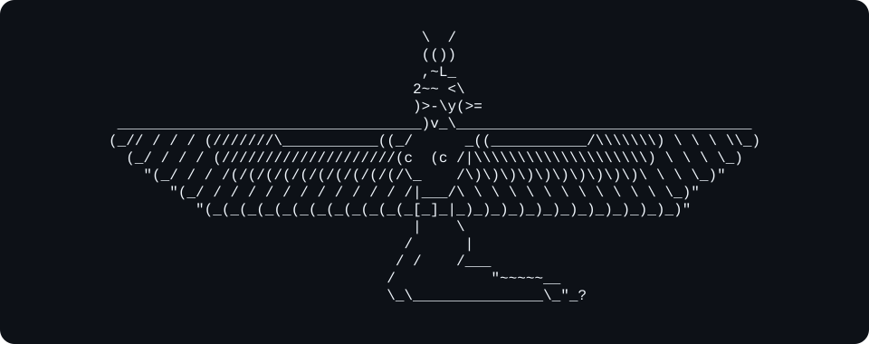

<div align="center">



<h1>JETSKI-Miner</h1>

<p><strong>State-of-the-art cryptocurrency miner</strong><br>NVIDIA GPUs. Linux, Windows and HiveOS.</p>

<p>
  <a href="https://github.com/jtskxx/JETSKI-Miner/releases"></a>
  <a href="https://github.com/jtskxx/JETSKI-Miner/releases"></a>
  <a href="#automatic-updates"></a>
  
  
  <a href="#hiveos"></a>
</p>

<p>
  <a href="https://github.com/jtskxx/JETSKI-Miner/releases"><strong>Download</strong></a> ·
  <a href="#quick-start">Quick start</a> ·
  <a href="#supported-algorithms">Algorithms</a> ·
  <a href="#options">Options</a> ·
  <a href="#hiveos">HiveOS</a>
</p>

</div>

## Features

- **Always up to date:** Automatic miner and kernel updates, delivered in place. No action needed
- **Always mining**: Automatic pool failover when pool goes offline and hot-key switch
- **Better data. Better tuning**: Live telemetry overclocks, core/mem clocks, hashrate and efficiency in your pool **HASHRATE** tab
- **Your GPU, tuned:** Auto-OC will benchmark your GPU and tune it for each kernel, within your temperature and/or power limits. ***Coming soon...***


***Coming soon:** AMD GPU and CPU support*

## Supported algorithms

| Coin | Algorithm | Command-line selection | Developer fee |
| --- | --- | --- | --- |
| Pearl | PearlHash | `-a pearlhash` | 2% |
| Quantus | Poseidon2 | `-a quantus` | 2% |


## Quick start

Download and extract the **[latest release](https://github.com/jtskxx/JETSKI-Miner/releases/latest)**, then launch the setup wizard:

- **Windows:** Double-click `JETSKI-Miner.exe`
- **Linux:** Run `./JETSKI-Miner` in the extracted folder

For command-line setup, see [Options](#options); for HiveOS, see [HiveOS setup](#hiveos)

Join **JETSKI Pool** at **[pool.jetskipool.ai](https://pool.jetskipool.ai/)**
## Options

**All command-line options**

```text
./JETSKI-Miner -a <algorithm> -u <wallet> -p <pool> -w <worker>
```

| Option | Purpose |
| --- | --- |
| `-a, --algorithm NAME` | Algorithm: `pearlhash` or `quantus` |
| `-u, --user ADDRESS` | Payout wallet address |
| `-p, --pool HOST:PORT` | Primary pool, explicit transport URLs are also accepted |
| `-w, --worker NAME` | Optional worker name |
| `--pool2 HOST:PORT` | Backup pool: add `--pool3`, `--pool4`, etc... |
| `--gpus LIST` | `auto`, `all` or indexes such as `0,2`; default: all visible GPUs |
| `--list-gpus` | List GPUs and exit |
| `--list-algorithms` | List supported algorithms and exit |
| `--log LEVEL` | `0`: compact - `1`: UTC timestamps and uptime - `2`: also GPU details |
| `--no-auto-update` | Disable automatic updates |
| `--no-telemetry` | Disable publisher telemetry |
| `-V, --version` | Show the version |
| `-h, --help` | Show help |

<details>
<summary><strong>Keyboard controls</strong></summary>

These controls work in an interactive terminal. Lowercase keys also work

| Key | Action |
| --- | --- |
| **S** | Pause mining |
| **R** | Resume mining |
| **P** | Switch to the next configured user pool |
| **O** | Switch to the previous configured user pool |
| **Ctrl+C** | Stop the miner |

Pool switching requires at least two configured pools

</details>

## HiveOS

In your Flight Sheet, select **Custom** miner and enter:

| Setting | Value |
| --- | --- |
| Miner name | `jetski-miner` |
| Installation URL | `https://dl2.jetskipool.ai/miner/hiveos/jetski-miner-latest.tar.gz` |
| Hash algorithm | `pearlhash` or `quantus` |
| Wallet and worker template | `%WAL%.%WORKER_NAME%` |
| Pool URL | Pool server |
| Extra config arguments | Optional, for example `--log 2` or `--gpus 0,2` |

- **Missing from HiveOS?** Set new algorithms and miner options directly in **Extra config arguments**. No need to wait for HiveOS to update its lists
Use `-a ALGORITHM` to override the algorithm field, e.g. `-a pearlhash`
- **Backup pools:** Add one pool per line in **Pool URL**, or use `--pool2 HOST:PORT` in **Extra config arguments**
- **Updates:** Keep the installation URL above. `--no-auto-update` disables both HiveOS package and miner updates

## Automatic updates

**Latest optimizations. Automatic delivery:** Miner and kernel updates download in the background. Miner upgrades install in place and restart with your settings preserved

Download any release and run it, automatically upgrades to the latest version. No need to download new version again

**Enabled by default.** Disable with **`--no-auto-update`**


## Telemetry and privacy

Telemetry lets miners compare GPU overclocks, live clocks, hashrate and efficiency in their **[JETSKI pool](https://pool.jetskipool.ai/)** **HASHRATE** tab. 
The same data helps push miner and kernel optimizations further

**Enabled by default.** Disable with **`--no-telemetry`**

<details>
<summary><strong>Privacy details</strong></summary>

**Collects:** GPU model, algorithm, OC settings, live clocks, hashrate, power/energy/efficiency reading and driver info

**Does not collect:** wallet addresses, worker names, user-pool addresses or GPU UUIDs

</details>

## Licence

Copyright © 2026 **JETSKI**. All rights reserved.

Proprietary software under the **[JETSKI Proprietary Licence](LICENSE)**.
](https://github.com/jtskxx/JETSKI-Miner)
